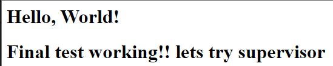

# jenkins/ansible learning

This repository is being used for test/learning for João Paulo Roslindo.

### Objective:
- Create a full CI/CD pipeline.
- Create a small test application using **Flask** that, when accessed at localhost:3000, will return a Hello world;
- Use **Jenkins** to do test the application;
- Use **Ansible** to do the deploy;
- Use **Docker** to create containerized applications.

### Containers:
There are 3 containers being used in this repository. Here are some special informations about it:
- Shared folder, each container has its own shared volume.
- Created my own network, where all my machines can communicate to each other.
- All containers have SSH to share commands. **password: 583614**
- In case you want to test it, please check which services each container uses and start it! (I did not do it by default ^^)

### Contents:

- #### Jenkins:
    - My pipeline manager:
        - **dockerfile and compose:** Used to create my container.
        - **pipeline:** My full pipeline, with ssh integration to Ansible.
- #### Ansible:
    - My container manager:
        - **dockerfile and compose:** Used to create my container.
        - **inventory.ini:** List the server's credentials/address.
        - **playbook:** Deploy my application to the server container.
- #### Server: 
    - That's the main application, to simulate a "server application". You will find:
        - **__main__.py:** The webpage using flask
        - **dockerfile and compose:** Used to create my container.
        - **poetry.lock and pyproject.toml:** A packet manager.
        - **test_example.py:** The simplest way I could think of to "test" the application.

### Pipeline quick explanation:
- Clone the repo;
- Install poetry and add to path. (Adding to path might not work, depends on the container so I will leave it here)
- Run the flask app in background, used on the test.
- Test the app.
- Deploy calling Ansible by ssh.

### Playbook quick explanation:
- Clone the repo on the server.
- Install packages with poetry.
- Restart the service responsible by running the application.

### Final application:
